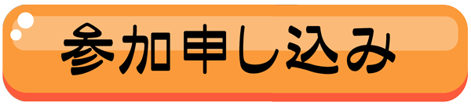

# ■ CoderDojo松山オフィシャルページ ■  
　CoderDojo(コーダー・ドージョー)は、コドモの"やってみたい"をプログラミングの世界でかなえる場所です。  
　大事なのは、”自分でやってみたい" って気持ちを持つこと。  
　その気持ちを受け取って、サポート役の"メンター"が一緒になって実現します。  
　初めてで不安な方も、一緒になって考えてみますのでお気軽に顔見せてください。   
    
   CoderDojoの日本支部　[CoderDojo Japan](https://coderdojo.jp/)   
   CoderDojo松山は 2019年に始まりました。   
   
### 会場が変わります  

   使用会場が、銀天街の新会場に変わります。場所は・・・ 
   〒790-0012 
   愛媛県松山市湊町4丁目10−6 BLESSビル3F 
   TEL 089-909-9809 
   コドモノイバショ 
   ※ごめんなさい、駐輪・駐車場がありません 
   

 

# ■ 次回開催予定 ■■■■■■■■■ 
コロナの様子見ながらの開催になります、直前に中止になる可能性もあります。ご容赦ください。   
開催日程一覧 
  
2022/5/8  Sun 13:00-17:00 
   
PH連絡先　<b>090-8283-3895(佐伯)  
 
参加申し込みはこちら： 
