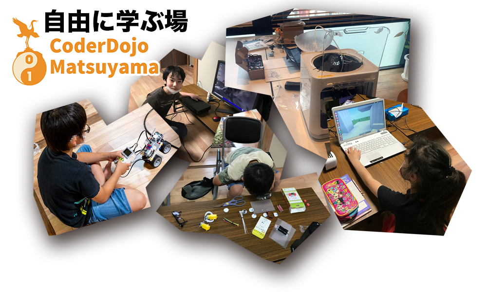
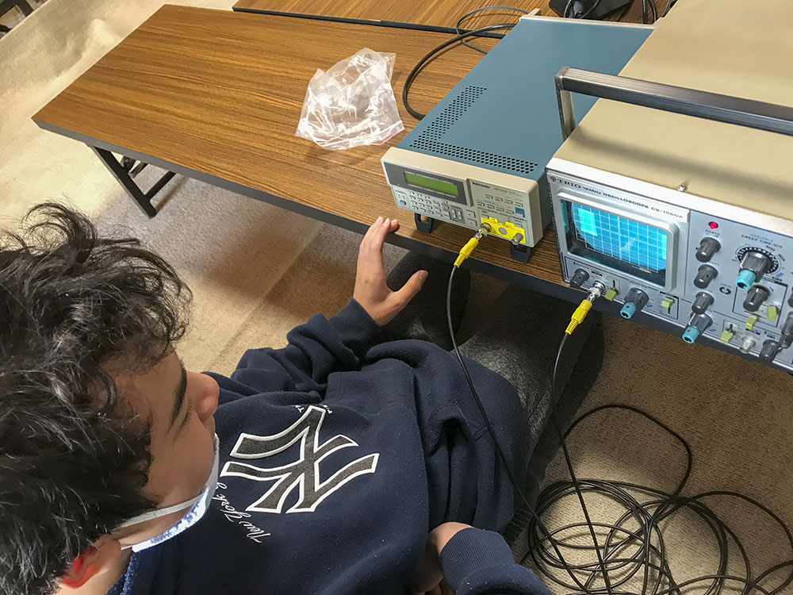
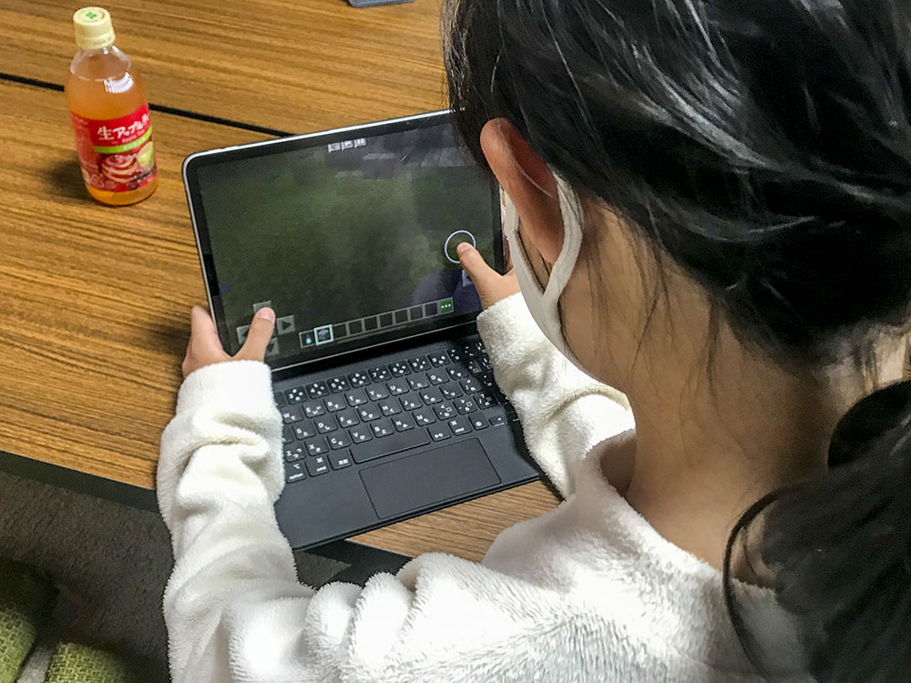
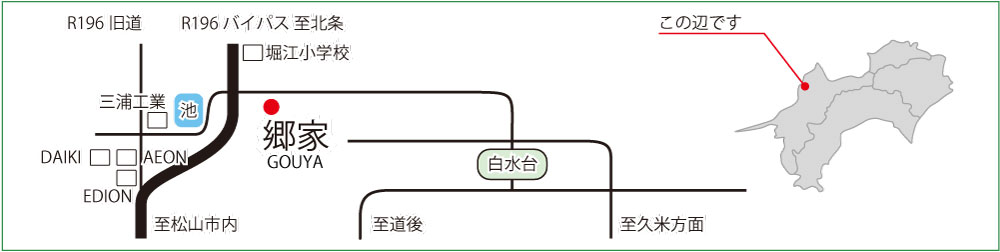

# ■ CoderDojo松山オフィシャルページ ■  
　CoderDojo(コーダー・ドージョー)は、コドモの"やってみたい"をプログラミングの世界でかなえる場所です。  
　大事なのは、”自分でやってみたい" って気持ちを持つこと。  
　その気持ちを受け取って、サポート役の"メンター"が一緒になって実現します。  
　初めてで不安な方も、一緒になって考えてみますのでお気軽に顔見せてください。   
    
   CoderDojoの日本支部　[CoderDojo Japan](https://coderdojo.jp/)   
   CoderDojo松山は 2019年から始まりました。   
   
ちなみに最近こんなことやってました。     
### よくわかんないけど、オシロ触ってみたり  
この子はYouTubeで昔のブラウン管がやその頃の映像がお気に入り。 それで、分からないながらも、 ブラウン管のついているオシロスコープに波形入力していろいろ試してます。 一見プログラミングとは関係ないように見えますが、プログラムで制御する対象を知ることも重要ですよね。

   
### マイクラで迷路作ったり  
この子は普段robroxとかやってて、マイクラも塾でやってるみたい。 ひたすら作ってますが、とにかく早い･･･!しかも、トラップ満載でかなり、やり応えあります。

   
 とにかく、プログラミングに関係あれば取り組み内容に<b> ○○しなきゃダメ </b>ってのはありません。   
 そのほかにも、 [Scratch](https://scratch.mit.edu/) とかもやってますよ！！！   
 [O](minecraft.md)
   
   
# ■ やってみない？ 部活募集！■■■■■■■
〇マイクラブ❤︎　マイクラについていろいろ取り組んでます。 
　マイクラサーバ上で共同作業とか、部員募集中！ 

   

# ■ 次回開催予定 ■■■■■■■■■ 
次回開催は2021年10月31日(日)13:00〜になります。  
コロナ禍であまり大勢の受け入れはできませんが、見学したいとかあればご相談ください。  
10月は学校行事も多いので、毎週開催になります。都合の良い日に覗いてみてください。  
参加予約は下記よりお願いいたします。  
[DoorKeeper　CoderDojo松山予約サイト](https://coderdojo-matsuyama.doorkeeper.jp/events/128924)  
### 開催予定カレンダー  
<iframe src="https://calendar.google.com/calendar/b/2/embed?height=600&amp;wkst=1&amp;bgcolor=%23ffffff&amp;ctz=Asia%2FTokyo&amp;src=bWF0c3V5YW1hX2VoaW1lLmpwQGNvZGVyZG9qby5jb20&amp;src=YWRkcmVzc2Jvb2sjY29udGFjdHNAZ3JvdXAudi5jYWxlbmRhci5nb29nbGUuY29t&amp;src=amEuamFwYW5lc2UjaG9saWRheUBncm91cC52LmNhbGVuZGFyLmdvb2dsZS5jb20&amp;color=%23039BE5&amp;color=%2333B679&amp;color=%23D50000&amp;showTitle=0&amp;showNav=1&amp;showDate=1&amp;showPrint=0&amp;showTabs=0&amp;showCalendars=0&amp;showTz=1" style="border:none #777" width="100%" height="650" frameborder="0" scrolling="no"></iframe>  
住所：799−2652　愛媛県松山市福角町626-2  
会員制寄合所　郷屋 ※今風に言うと、民家コワーキングスペースです！ 
駅、バス停が遠いですが、駐車場はあります。 
  
[google Map](https://www.google.co.jp/maps/place/33%C2%B053'55.7%22N+132%C2%B045'33.3%22E/@33.898791,132.7586865,19z/data=!3m1!4b1!4m14!1m7!3m6!1s0x354fe40c9c8779a9:0x95313caa7b057e6e!2z44CSNzk5LTI2NTIg5oSb5aqb55yM5p2-5bGx5biC56aP6KeS55S6!3b1!8m2!3d33.8950921!4d132.7589084!3m5!1s0x0:0x0!7e2!8m2!3d33.8987909!4d132.7592348?hl=ja)  
　道路脇で、目印も少なく分かりづらいです。お気軽に下記まで電話頂ければ幸いです。  
PH連絡先　<b>090-8283-3895(佐伯)  
